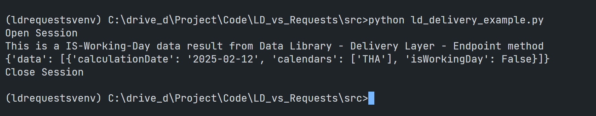

# Comparison of Data Library for Python VS Python/requests direct call for the Delivery Platform (RDP)
- version: 1.0
- Last update: February 2025
- Environment: Windows
- Compiler: Python

## <a id="data_library_intro"></a>Introduction to Data Library

Let’s start with an introduction to the Data Library. The Data Library provides a set of ease-of-use interfaces offering coders uniform access to the breadth and depth of financial data and services available on the LSEG Data Platform. The Library is designed to provide consistent access through multiple access channels and target both Professional Developers and Financial Coders.


The library is available the following programming languages

- [Python](https://developers.lseg.com/en/api-catalog/lseg-data-platform/lseg-data-library-for-python)
- [.NET](https://developers.lseg.com/en/api-catalog/lseg-data-platform/lseg-data-library-for-net)
- [TypeScript](https://developers.lseg.com/en/api-catalog/refinitiv-data-platform/refinitiv-data-library-for-typescript)

Once connected, applications can rely on easy-to-use objects and functions to access the breadth and depth of data services available on the platform. Or alternatively, applications can use service-agnostic lower layer, that enable an access to the fine-grained details of each platform service. 


### Data Library Abstraction Layers

Depending on the skill and comfort level of the developer, the library offers various of API interface layers from high-level Access Layer, medium-level Content Layer, and a low-level Delivery Layer that suit different types of developers. 


**Note**:
- This project demonstrates with the LSEG Data Library for Python which is the version 2.0.1 of the library (**As of February 2025**)
- For High performance scenarios, the Real-Time SDK ([C++](https://developers.lseg.com/en/api-catalog/real-time-opnsrc/rt-sdk-cc), [Java](https://developers.lseg.com/en/api-catalog/real-time-opnsrc/rt-sdk-java), [C#](https://developers.lseg.com/en/api-catalog/real-time-opnsrc/rt-sdk-csharp)) and [Real-Time WebSocket API](https://developers.lseg.com/en/api-catalog/real-time-opnsrc/websocket-api) are recommended

That covers the Data Library overview.

## <a id="authen"></a>Initialize and Authentication

That brings us to working with the RDP APIs platform. RDP APIs entitlement check is based on OAuth 2.0 specification. The first step of an application work flow is to get a token, which will allow access to the protected resource, i.e. data REST API's.  The RDP currently supports two version of Authentication methods (**As of February 2025**).

Both RDP APIs and Data Library PlatformSession applications require the RDP access credential and login process to get data from the platform.

### Version 1 Authentication - Initial Login

So, I will start off with the Version 1 Authentication. The API endpoint **https://api.refinitiv.com/auth/oauth2/v1/token** (please be noticed **v1**) requires the following access credential information:

- Username: The username. 
- Password: Password associated with the username. .
- Client ID: This is also known as ```AppKey```, and it is generated using an Appkey Generator. This unique identifier is defined for the user or application and is deemed confidential (not shared between users).
-  Grant Type **password**

#### Direct RDP APIs call with Python/requests

The application needs to send a HTTP Post message with the access credentials to RDP Auth Service endpoint URL (V1). 

A successful authentication response message from RDP Auth Service contains the following parameters:

- **access_token**: The token used to invoke REST data API calls as described above. The application must keep this credential for further RDP/Real-Time - Optimized requests.
- **refresh_token**: Refresh token to be used for obtaining an updated access token before expiration. The application must keep this credential for access token renewal.
- **expires_in**: Access token validity time in seconds.
- **scope**: A list of all the scopes this token can be used with.

For the full detail and explanation of RDP Authentication process application workflow, please refer to the following RDP APIS tutorials:

- [Introduction to the Request-Response API](https://developers.lseg.com/en/api-catalog/refinitiv-data-platform/refinitiv-data-platform-apis/tutorials#introduction-to-the-request-response-api).
- [Authorization - All about tokens](https://developers.lseg.com/en/api-catalog/refinitiv-data-platform/refinitiv-data-platform-apis/tutorials#authorization-all-about-tokens).
- [Authorization in Python](https://developers.lseg.com/en/api-catalog/refinitiv-data-platform/refinitiv-data-platform-apis/tutorials#authorization-in-python).

Example Code with Python request library (see ```requests_session_v1.py``` file):

```python

import requests

RDP_HOST = 'https://api.refinitiv.com'

auth_url = f'{RDP_HOST}/auth/oauth2/v1/token'
scope = 'trapi'

# For the Password Grant scenario
payload=f'username={username}&password={password}&grant_type=password&scope={scope}&takeExclusiveSignOnControl=true&client_id={app_key}'

try:
    response = requests.post(auth_url, 
                                data=payload, 
                                headers={'Content-Type': 'application/x-www-form-urlencoded'},
                                verify=True,
                                allow_redirects=False)
except requests.exceptions.RequestException as e:
    print(f'RDP Authentication exception: {e}')
    return None, None, None

if response.status_code == 200:  # HTTP Status 'OK'
    print('Authentication success')
    return response.json()['access_token'], response.json()['refresh_token'], int(response.json()['expires_in'])
# Handle Errors

```

The above code is very straightforward, the application creates an authentication request message in JSON message format, send HTTP Post request message and get authentication result if HTTP status response is 200 (Ok).  Please note that it is mandatory to keep the access token, refresh token, and expires_in values for later use.

However, the Data Library gives developers the easiest way to authenticates with RDP Auth Service.

#### Data Library

With Data Library, developers can configure the RDP access credential in a configuration file name ```lseg-data.config.json``` as follows:


```json
{
    "sessions": {
        "default": "platform.ldp",
        "platform": {
            "ldp": {
                "app-key": "YOUR APP KEY GOES HERE!",
                "username": "YOUR LDP LOGIN OR MACHINE GOES HERE!",
                "password": "YOUR LDP PASSWORD GOES HERE!",
                "signon_control":true
            }
        }
    }
}
```

The file must be located on a running directory of an application. Then uses the following code to open a connection with the platform.

Example Code (see ```ld_session.py``` file)

```python
import lseg.data as ld

# Open the data session
ld.open_session()

# request data
```

That is all the code the Data Library application needs to call to login and connect to the RDP platform. An application also does not need to manage the access token, refresh token and expires_in values as the Library manages them for an application.

An application can also use the Library's Session Layer to get the status of a connection as follows:

```python
import lseg.data as ld
from lseg.data import session

# Open the data session
ld.open_session()
session = ld.session.Definition().get_session()
session.open()
if str(session.open_state) == 'OpenState.Opened': # Session is opened successfully

# code to request data

```

Please note that developers can choose to pass an access credential to the Library function directly too. Please see more detail on the [GitHub](https://github.com/LSEG-API-Samples/Example.DataLibrary.Python/tree/lseg-data-examples/Examples/4-Session) repository.

### Version 1 Authentication - Refresh Login

Before the session expires (based on the ```expires_in``` parameter, in seconds) , an application needs to send a Refresh Grant request message to RDP Authentication service (**https://api.refinitiv.com/auth/oauth2/v1/token** URL) to get a new access token before further request data from the platform.

The API requires the following access credential information:

- Refresh Token: The current Refresh Token value from the previous RDP Authentication call
- Client ID: This is also known as AppKey, and it is generated using an App key Generator. 
- Grant Type **refresh_token**: This is for getting a new Access Token.

Once the refresh token process is succeed, an application gets ```access_token```, ```refresh_token```, and ```expires_in``` from the RDP Auth service response message the same as an initial Login RDP Authentication call. An application must keep those value for the next Refresh Token call.

#### Direct RDP APIs call with Python/requests

The code can send a refresh grant request message to the RDP Authentication Service Endpoint (V1) the same way as an initial login request.

```python
auth_url = f'{RDP_HOST}/auth/oauth2/v1/token'

# For the Refresh Grant scenario
payload=f'grant_type=refresh_token&client_id={app_key}&refresh_token={refresh_token}'

try:
    response = requests.post(auth_url, 
                                data=payload, 
                                headers={'Content-Type': 'application/x-www-form-urlencoded'},
                                verify=True,
                                allow_redirects=False)
except requests.exceptions.RequestException as e:
    print(f'RDP Authentication Refresh Token exception: {e}')
    return None, None, None
```

Even though the code is the almost same as an initial login request message, an application has a responsibility to manage and handle an ```expires_in``` value.

#### Data Library

With the Data Library, the library automatic maintains the RDP session under the hood for an application as long as an application does not call the close session method explicitly. 

### Version 1 Authentication - Revoke Login

This revocation mechanism allows an application to invalidate its tokens if the end-user logs out, changes identity, or exits the respective application. Notifying the authorization server that the token is no longer needed allows the authorization server to clean up data associated with that token (e.g., session data) and the underlying authorization grant.

#### Direct RDP APIs call with Python/requests

The code can send a HTTP request message to **https://api.refinitiv.com/auth/oauth2/v1/revoke** with the following condition in order to revoke the current access token.

- HTTP Header: 
    * Authorization = ```Basic <App Key in Base64 format>```
Please notice *the space* between the ```Basic``` and ```App Key in Base64 format``` values.

- Body parameter
    * token: The current ```Access Token``` value from the previous RDP Authentication call

Example Code:

```python
import base64

app_key_bytes = app_key.encode('ascii')
base64_bytes = base64.b64encode(app_key_bytes)
app_key_base64 = base64_bytes.decode('ascii')

auth_url = f'{RDP_HOST}/auth/oauth2/v1/revoke'

payload = f'token={access_token}'

try:
    response = requests.post(auth_url,
                                data = payload,
                                headers= {
                                    'Content-Type':'application/x-www-form-urlencoded',
                                    'Authorization': f'Basic {app_key_base64}'
                                },
                                auth=(app_key, ''))
except requests.exceptions.RequestException as e:
    print(f'RDP Authentication Revoke exception: {e}')
```

Now, let's see how the Data Library close a session.

#### Data Library

An application can just call a single library method to close a connection as follows:

```python
import lseg.data as ld

# Open Session

# Close Default Session
ld.close_session()
```

Let's leave the Version 1 Authentication there.

### Version 2 Authentication - Initial Login

Now, what about the Version 2 Authentication? The API endpoint **https://api.refinitiv.com/auth/oauth2/v2/token** (please be noticed **v2**) requires the following access credential information:

- client_id ID: The Service ID (aks Service User). 
- client_secret: Password associated with the Service user.
- Grant Type **client_credentials**
- scope (optional): Limits the scope of the generated token so that the Access token is valid only for a specific data set

**Note**: The ```V2 client_id``` **is not the same value** as the ```V1 client_id```. The ```V1 client_id``` is an ```app key``` of the [V1 - Password Grant Model](https://www.oauth.com/oauth2-servers/access-tokens/password-grant/).

Please see more detail about the Version 2 Authentication from the [Getting Started with Version 2 Authentication for Real-Time - Optimized: Overview](https://developers.lseg.com/en/article-catalog/article/getting-started-with-version-2-authentication-for-refinitiv-real) article.

#### Direct RDP APIs call with Python/requests 

The code is almost identical to the Version 1 Authentication, but an application needs to send a HTTP request message to RDP Auth Service endpoint URL (V2) instead. 

A successful authentication response message from RDP Auth Service contains the following parameters:

- **access_token**: The token used to invoke REST data API calls as described above. The application must keep this credential for further RDP APIs requests.
- **expires_in**: Access token validity time in seconds.
- **token_type (required)**: The type of token this is, typically just the string “Bearer”.

Example Code in Python (```requests_session_v2.py``` file)

```python
import requests

RDP_HOST = 'https://api.refinitiv.com'
auth_url = f'{RDP_HOST}/auth/oauth2/v2/token'

# For the Password Grant scenario
payload=f'client_id={client_id}&client_secret={client_secret}&grant_type=client_credentials&scope={scope}'

try:
    response = requests.post(auth_url, 
                                data=payload, 
                                headers={'Content-Type': 'application/x-www-form-urlencoded'},
                                verify=True,
                                allow_redirects=False)
except requests.exceptions.RequestException as e:
    print(f'RDP Authentication exception: {e}')
    return None, None, None
    
if response.status_code == 200:  # HTTP Status 'OK'
    print('Authentication success')
    return response.json()['access_token'],  int(response.json()['expires_in'])
# Handle Error
```

Then, it is mandatory for an application level to keep and handle the returned access token and expires_in values for later use.

Now let's see how an application can login to RDP with the Version 2 Authentication via the Data Library.

#### Data Library

With Data Library, developers can configure the RDP Version 2 Authentication access credential in a configuration file name ```lseg-data.config.json``` as follows:


```json
{
    "sessions": {
        "default": "platform.ldpv2",
        "platform": {
            "ldpv2": {
                "client_id": "Service-ID (Client ID V2)",
                "client_secret": "Client Secret",
                "signon_control":true,
                "app-key": ""
            }
        }
    }
}
```

**Note**: Please be noticed that a ```default``` attribute has been set to *platform.ldpv2* value.

Then use the following code in an application to open a connection.

Example Code (see ```ld_session.py``` file)

```python
import lseg.data as ld

# Open the data session
ld.open_session()

# request data
```

The code looks exactly the same as the Version 1 Authentication setting. Developers can just change a configuration file without a need to modify source code.

### Version 2 Authentication - Refresh Login

Unlike the Version 1 Authentication, the Version 2 Authentication does not use a refresh grant logic. If the application needs a refreshing token, the application can just re-send a new authentication request (with ```grant_type``` of **client_credentials** ) to the RDP endpoint.

#### Direct RDP APIs call with Python/requests 

An application can just use the same login request code to refresh an access token.

#### Data Library

Like the Version 1 Authentication, once an application calls ```ld.open_session()``` method, the library maintains and refreshes access token for an application.

### Version 2 Authentication - Revoke Login

The Version 2 Authentication aims for the Real-Time Optimized (RTO) streaming consumers which requires long lasting connection scenario, so the it does not need to revoke access token. 

#### Direct RDP APIs call with Python/requests 

An application can just close a connection to stop using an access token.

#### Data Library

Like the Version 1 Authentication, once an application calls ```ld.close_session()``` method, the library closes a connection and session with RDP platform.

That is all for the session management code.

## <a id="rdp_get_data"></a>Requesting Data from RDP APIs

Now we come to data requesting process. After login and open a session with the RDP platform, an application can request data from the platform.

#### Direct RDP APIs call with Python/requests 

All subsequent REST API calls use the Access Token via the *Authorization* HTTP request message header as shown below to get the data. 

- Header: 
    * Authorization = ```Bearer <RDP Access Token>```

Please notice *the space* between the ```Bearer``` and ```RDP Access Token``` values.

The application then creates a request message in a JSON message format or URL query parameter based on the interested service and sends it as an HTTP request message to the Service Endpoint. Developers can get RDP APIs the Service Endpoint, HTTP operations, and parameters from RDP [API Playground page](https://apidocs.refinitiv.com/Apps/ApiDocs) - which is an interactive documentation site developers can access once they have a valid RDP account.

#### Direct RDP APIs call with Python/requests - Historical Pricing Interday Data

The Historical Pricing Interday Data URL endpoint is **/data/historical-pricing/v1/views/interday-summaries/{{universe}}** URL. An application can send the HTTP request message to this endpoint.

Example Code in Python (see ```requests_historical.py```)

```python

# https://api.refinitiv.com/data/historical-pricing/v1/views/interday-summaries/{{universe}}
historical_pricing_url = f'{RDP_HOST}/data/historical-pricing/v1/views/interday-summaries/{universe}'

payload = {'interval': 'P1W', 
            'count':15,
            'fields':'BID,ASK,OPEN_PRC,HIGH_1,LOW_1,TRDPRC_1,NUM_MOVES,TRNOVR_UNS',
            'start':'2025-01-01',
            'end':'2025-02-10'}

try:
    response = requests.get(url= historical_pricing_url,
                            headers= {
                                'Authorization': f'Bearer {access_token}'
                            }, 
                            params= payload,
                            verify=True,
                                allow_redirects=False)
except requests.exceptions.RequestException as e:
    print(f'RDP historical-pricing request exception: {e}')
```

The response is in JSON message format as follows:


An application can parse the JSON data above to interpret or process data based on their business requirements.

### Data Library - Access Layer

Let me start by using the simplest Data Library API Interface, the Access Layer.

The Access Layer is the easiest way to retrieve LSEG data. It is a set of simplified API interfaces allowing developers to quickly prototype solutions in interactive environments such as Python Jupyter Notebook. The functions and objects of Access Layer are dedicated to Financial Coders. 

#### Access Layer - Historical Pricing Interday Data

To get the Historical data, the Access Layer offers the ```get_history()``` method for developers.

Example Code (see ```ld_access_historical.py```)

```Python
import lseg.data as ld

universe = 'IBM.N'
fields=['BID','ASK','OPEN_PRC','HIGH_1','LOW_1','TRDPRC_1','NUM_MOVES','TRNOVR_UNS']

df = ld.get_history(universe=universe,
                    interval='weekly', 
                    fields=fields,
                    count=15,
                    start='2025-01-01',
                    end= '2025-02-10')

print('This is a Historical Pricing Inter-Day data result from Data Library - Access Layer - get_history method')
print(df)
```

That is, just one simple method calls. An application does not need to manage HTTP request, access token, and the URL endpoint manually as the library manages those tasks behind the scene for an application.

The result of a function call looks like this:


You may be noticed that the response data format is different from the direct RDP call. The returned data from the Library Access Layer is in DataFrame format because the Access Layer is optimized for Financial application environment like the Jupyter Notebook.

Please see the [requests_news.py](./src/requests_news.py) and [ld_access_news.py](./src/ld_access_news.py) for other direct Python requests call and Data Library Access Layer comparison for News data.

Please see more detail regarding the Access Layer classes in [Access Layer examples](https://github.com/LSEG-API-Samples/Example.DataLibrary.Python/tree/lseg-data-examples/Examples), [Tutorials](https://github.com/LSEG-API-Samples/Example.DataLibrary.Python/tree/lseg-data-examples/Tutorials/1.Access) and [The Data Library for Python  - Quick Reference Guide (Access layer)](https://developers.lseg.com/en/article-catalog/article/the-data-library-for-python-quick-reference-guide-access-layer) article.

That covers the basics of the Data Library Access Layer.

#### Direct RDP APIs call with Python/requests - ESG Data

The next RDP content that I am going to demonstrate is the ESG service. To get the ESG (Environmental, Social, and Governance) standard measures data, an application must send a HTTP request message to the RDP **/data/environmental-social-governance/{{RDP_VERSION_ESG}}/views/scores-standard?universe={{SYMBOL}}** URL as follows.

```Python
esg_url = f'{RDP_HOST}/data/environmental-social-governance/v2/views/scores-standard'
payload = {'universe': 'IBM.N'}

try:
    response = requests.get(url= esg_url,
                            headers= {
                                'Authorization': f'Bearer {access_token}'
                            }, 
                            params= payload,
                            verify=True,
                                allow_redirects=False)
except requests.exceptions.RequestException as e:
    print(f'RDP ESG request exception: {e}')
```

The result is JSON message format as follows


### Data Library - Content Layer

That brings us to other Layer that the library provides for developers, the Content Layer. The Content layer refers to logical market data objects, representing financial items like level 1 market data prices and quotes, News, Historical Pricing, Bond Analytics, Environmental & Social Governance (ESG)  and so on. These objects are built on top of the Delivery layer and provide value-add capabilities to manage and access the content within the interface.

The Content Layer lets developer choose to get returns data in JSON structured messages or user-friendly Pandas DataFrame for Python based on their requirements.

The Content layer can easily be used by both professional developers and financial coders. It provides great flexibility for familiar and commonly used financial data models.

#### Content Layer - ESG Data

The Content Layer offers the **esg** class and its methods for developers to access ESG data.

The following code shows to get ESG standard measures with the Data Library Content Layer.

Example Code (see ```ld_content_esg.py```)

```python
from lseg.data.content import esg

# Open Session

response = esg.standard_scores.Definition(universe).get_data()

print('This is an ESG data result from Data Library - Content Layer - esg.standard_scores')
# print raw data 
print(response.data)
```

I am using ```response.data``` method to show a response data in raw format (which is JSON). The data structure is identical to the direct Python/requests call except it include additional attributes added by the library.


To get data in Pandas DataFrame format, developers can use this method to get data.

```python
response = esg.standard_scores.Definition(universe).get_data()

print(response.data.df)
```


You see that even the Content Layer is just a little bit complex than the Access Layer but it is still just one method call. This Layer provides a response data in various type such as the raw data (JSON) and Pandas Dataframe. Developers can choose the best data type that match their requirement without need to manual convert the type in the application level.

The Content Layer also supports more application operation modes such as Asynchronous/Event-Driven, the real-time Streaming requests for Level 1 Market Price data, IPA, Searching, Symbology, etc. Please see more detail regarding the Content Layer in [Content Layer examples](https://github.com/LSEG-API-Samples/Example.DataLibrary.Python/tree/lseg-data-examples/Examples/2-Content) and [Tutorials](https://github.com/LSEG-API-Samples/Example.DataLibrary.Python/tree/lseg-data-examples/Tutorials/2.Content).

That’s all I have to say about the Content Layer.

### Data Library - Delivery Layer

Now let me move on to the final Layer, the Delivery Layer.

LSEG is developing the library and hope to offer Access and Content Layers support for other data content. In the meantime, the Library also lets developers access to a wide range of content that not available in Access and Content Layers yet with the Delivery Layer. 

The Layer provides objects for developers to interact with the Delivery Platform (formerly Refinitiv Data Platform) service through the following delivery modes:

- Request (HTTP Request/Response)
- Stream (WebSockets)
- Queue (Alerts)
- Files (bulk)

Classes defined in the Delivery layer are not dependent on any specific data service exposed by the Delivery Platform. They are service-agnostic, in that you can use them to access any service available on the platform.

The Delivery Layer is the low-level API interfaces that targets developers who need specific features that are not offered by other higher level abstraction layers (Content & Access Layers). 

This layer targets professional developers but can also be used by financial coders with good programming skills. Please be noticed that developers needs to check the RDP platform services from the RDP [API Playground page](https://apidocs.refinitiv.com/Apps/ApiDocs) page.

#### Delivery Layer - Endpoint Request Class 

One of the objects provided by the Delivery Layer is the **Endpoint Request** class. It is a wrapper around the Request (HTTP Request/Response) delivery mechanism of the RDP APis. It is designed as the lowest abstraction layer that allows the retrieval of raw data from Delivery Platform API.

I am demonstrating with the **https://api.refinitiv.com/analytics/functions/v1/common/is-working-day** API endpoint which lets developers check if a date is a working day of requested Country. The Python/requests direct code should be simple to set HTTP POST message to the endpoint. However, the Delivery - Layer Endpoint class helps developers to interact with the RDP APIs HTTP request in a easiest way.

```python
from lseg.data.delivery import endpoint_request

analytic_url = 'https://api.refinitiv.com/analytics/functions/v1/common/is-working-day'

payload = {
    'universe': [{
            'calendarCodes': codes,
            'calculationDate': date
        }]
    }

request = ld.delivery.endpoint_request.Definition(
    url = analytic_url,
    method= ld.delivery.endpoint_request.RequestMethod.POST,
    body_parameters= payload
)
response = request.get_data()
print('This is a IS-Working-Day data result from Data Library - Delivery Layer - Endpoint method')
print(response.data.raw)
```

The code above checks if 12th February 2025 is Thailand public holiday (it is [Makha Bucha Day](https://en.wikipedia.org/wiki/M%C4%81gha_P%C5%ABj%C4%81)). 

This **/analytics/functions/v1/common/is-working-day** supports HTTP POST method, so the Python/requests should be easy to code. However, the Library's Delivery Layer Endpoint class lets developers create a HTTP POST request message in an easiest way. An application can send a POST message payload via the Endpoint's ```body_parameters``` attribute.

The data response of the Endpoint class is in JSON message format which developers can parse and transform to other format if need.



Next, I am demonstrating how to use the Endpoint object with the RDP service that uses HTTP GET method. The API is **/data/historical-pricing/v1/views/events/{universe}** endpoint which can be used via Access or Content Layer. However, the code with Delivery Layer is not much harder than those high-levels layer API interface.


```python
historical_url = 'https://api.refinitiv.com/data/historical-pricing/v1/views/events/{universe}'

request = ld.delivery.endpoint_request.Definition(
    url = historical_url,
    method= ld.delivery.endpoint_request.RequestMethod.GET,
    path_parameters={'universe':'IBM.N'},
    body_parameters= {
        'eventTypes': 'trade,correction',
        'adjustments': 'exchangeCorrection,manualCorrection'
}
)

response = request.get_data()
print('This is a Historical Pricing Event data result from Data Library - Delivery Layer - Endpoint method')
print(response.data.raw)
```

The code above sends a HTTP request message to the RDP endpoint via the GET method. The ```path_parameters``` attribute is for setting the parameters that can be added to the endpoint URL (```/data/historical-pricing/v1/views/events/{universe}```) . The ```body_parameters``` attribute is for setting the query parameters for the HTTP request.

The result will be in the JSON message format similar to the direct Python/requests approach as follows:


As I has mentioned at the beginning of this section, the Delivery Layer does not has only Endpoint object. It also has other objects like the OMM Stream, RDP Stream, Bulk, etc. which can helps developers archive specific tasks that cannot be done with the Access and Content Layers.

Developers can find more detail about the Delivery Layer from [Delivery Layer examples](https://github.com/LSEG-API-Samples/Example.DataLibrary.Python/tree/lseg-data-examples/Examples/3-Delivery) and [Tutorials](https://github.com/LSEG-API-Samples/Example.DataLibrary.Python/tree/lseg-data-examples/Tutorials/3.Delivery)

The reference guide of all Data Library layers and API interfaces are available on the Developer Portal [Data Library for Python - Reference Guide](https://developers.lseg.com/en/api-catalog/lseg-data-platform/lseg-data-library-for-python/documentation#reference-guide) article.

That covers the Data Library and direct Python requests code comparison for the RDP platform applications.