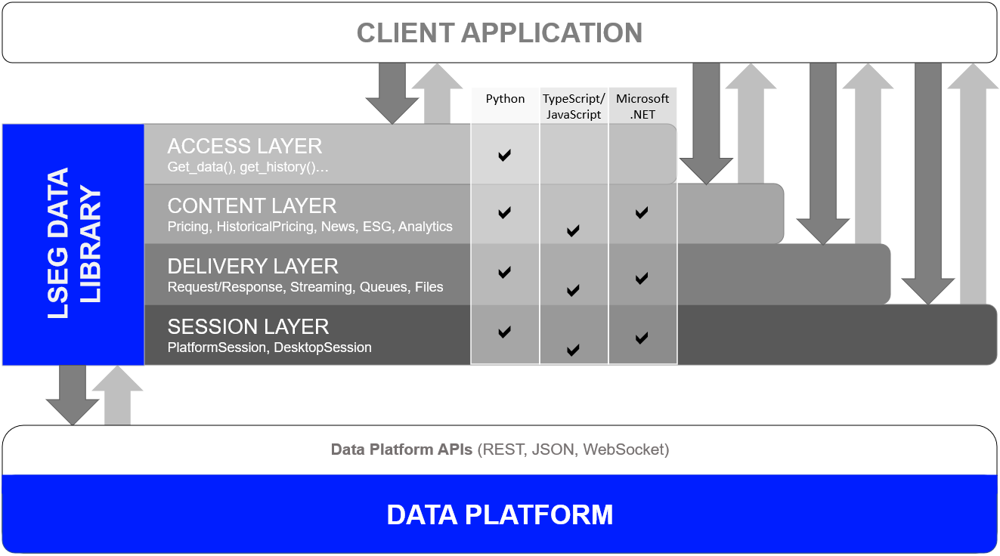

# Comparison of Data Library for Python VS Python/requests direct call for the Delivery Platform (RDP)

- version: 1.0
- Last update: February 2025
- Environment: Windows
- Compiler: Python
- Prerequisite: [Access to RDP credentials](#prerequisite)

## <a id="introduction"></a>Introduction

This project is forked from my old [Comparison of RDP Libraries for Python VS Python/requests direct call for Refinitiv Data Platform](https://github.com/LSEG-API-Samples/Example.RDPLibrary.Python.RequestsComparison) project because the library is outdated. This project aims to use the strategic [LSEG Data Library for Python](https://developers.lseg.com/en/api-catalog/lseg-data-platform/lseg-data-library-for-python).

The [Delivery Platform (RDP) APIs](https://developers.lseg.com/en/api-catalog/refinitiv-data-platform/refinitiv-data-platform-apis) (formerly known as Refinitiv Data Platform) provide various LSEG data and content for developers via easy to use Web base API. The developers which are data scientist, financial coder or trader can use any programming languages that support HTTP request-response and JSON message to retrieve content from RDP in a straightforward way. An example use case are data scientists or trader use [Python language](https://www.python.org/) with the [requests library](https://requests.readthedocs.io/en/master/) to get data from RDP and visualize that data in [Jupyter Notebook](https://jupyter.org/) application.

The strategic [LSEG Data Library for Python](https://developers.lseg.com/en/api-catalog/lseg-data-platform/lseg-data-library-for-python) (aka Data Library version 2) are ease-of-use APIs defining a set of uniform interfaces providing the developer access to the RDP, Real-Time, and Workspace platforms. The libraries let developers can get data easier than using RDP APIs with Python and requests library directly. 

This article demonstrates how easy developers can get LSEG content via Data Library by comparing the application source code using the library ```PlatformSession ``` versus the code using Python/requests to get the same data. The comparison also can be applied to developers who use other Python HTTP libraries such as [http.client](https://docs.python.org/3.10/library/http.client.html) or [urllib.request](https://docs.python.org/3.10/library/urllib.request.html).

Note: This article is focusing on **the comparison of how to get data** only. The reason is once the application receives data from either direct RDP APIs call or Data library, the data processing or visualize logic are the same.

## <a id="data_library_intro"></a>Introduction to Data Library

The Data Library provides a set of ease-of-use interfaces offering coders uniform access to the breadth and depth of financial data and services available on the LSEG Data Platform. The Library is designed to provide consistent access through multiple access channels and target both Professional Developers and Financial Coders.


The library is available the following programming languages

- [Python](https://developers.lseg.com/en/api-catalog/lseg-data-platform/lseg-data-library-for-python)
- [.NET](https://developers.lseg.com/en/api-catalog/lseg-data-platform/lseg-data-library-for-net)
- [TypeScript](https://developers.lseg.com/en/api-catalog/refinitiv-data-platform/refinitiv-data-library-for-typescript)

Once connected, applications can rely on easy-to-use objects and functions to access the breadth and depth of data services available on the platform. Or alternatively, applications can use service-agnostic lower layer, that enable an access to the fine-grained details of each platform service. This makes the library ideal for different types of developers.



**Note**:
- This project demonstrates with the LSEG Data Library for Python which is the version 2.0.1 of the library (**As of February 2025**)
- For High performance scenarios, the Real-Time SDK ([C++](https://developers.lseg.com/en/api-catalog/real-time-opnsrc/rt-sdk-cc), [Java](https://developers.lseg.com/en/api-catalog/real-time-opnsrc/rt-sdk-java), [C#](https://developers.lseg.com/en/api-catalog/real-time-opnsrc/rt-sdk-csharp)) and [Real-Time WebSocket API](https://developers.lseg.com/en/api-catalog/real-time-opnsrc/websocket-api) are recommended

## <a id="prerequisite"></a>Demo Applications Prerequisite

This demo project requires the following dependencies.

1. RDP Access credentials.
2. [Python](https://www.python.org/) compiler and runtime.
3. [LSEG Data Library for Python](https://pypi.org/project/lseg-data).
4. Internet connection

Please contact your LSEG's representative to help you to access RDP credentials.

## <a id="article"></a>

See the [Article.md](./Article.md) for more detail.

## <a id="files_list"></a>Application Files

This example project contains the following files and folders

- *src/requests_session_v1.py*: Demo application that shows how to use Python requests to manage RDP session with Authentication Version 1.
- *src/requests_session_v2.py*: Demo application that shows how to use Python requests to manage RDP session with Authentication Version 2.
- *src/requests_historical.py*: Demo application that shows how to use Python requests to request Historical pricing data.
- *src/requests_news.py*: Demo application that shows how to use Python requests to request News data.
- *src/requests_esg.py*: Demo application that shows how to use Python requests to request ESG data.
- *src/ld_session.py*: Demo application that shows how to use Data Library to manage RDP session (with both Version 2 and 1).
- *src/ld_access_historical.py*: Demo application that shows how to use Data Library Access Layer to request Historical pricing data.
- *src/ld_access_news.py*: Demo application that shows how to use Data Library Access Layer to request news data.
- *src/ld_content_esg.py*: Demo application that shows how to use Data Library Content Layer to request ESG data.
- *src/ld_content_historical.py*: Demo application that shows how to use Data Library Content Layer to request Historical pricing data.
- *src/ld_delivery_example.py*: Demo application that shows how to use Data Library Delivery Layer Endpoint feature to request RDP data.
- *src/lseg-data.config.json*: Data Library version 2 configurations file.
- *src/.env.example*: Example .env file for the Python requests examples.
- *requirements.txt*: Project Python dependencies file.
- *README.md*: Project README file.

## <a id="how_to_run"></a>How to run the demo examples in a console

The first step is unzip or download the example project folder into a directory of your choice, then choose how to run application based on your environment below.

1. Open the ```src/lseg_data.config.json``` file and add your RTO or RTDS information based on your preference

    ```json
    "sessions": {
        "default": "platform.ldp",
        "platform": {
            "ldp": {
                "app-key": "YOUR APP KEY GOES HERE!",
                "username": "YOUR LDP LOGIN OR MACHINE GOES HERE!",
                "password": "YOUR LDP PASSWORD GOES HERE!",
                "signon_control":true
            },
            "ldpv2":{
                "client_id": "Service-ID (Client ID V2)",
                "client_secret": "Client Secret",
                "signon_control":true,
                "app-key": ""
            },
        }
    }
    ```

2. Please note that the ```platform``` configuration is based on your connection information:
    
    - if you are using the RDP with the *Version 1 Authentication*, the ```default``` value must be ```platform.ldp```.
    - if you are using the RDP with the *Version 2 Authentication*, the ```default``` value must be ```platform.ldpv2```.

3. Create a file name ```.env``` at the root folder of the project and then add the following content to a file

    ```ini
    ## Authentication Version 2
    CLIENT_ID='YOUR_CLIENT_ID'
    CLIENT_SECRET='YOUR_CLIENT_SECRET'

    ## Authentication Version 1
    MACHINE_ID='YOUR_MACHINE_ID'
    PASSWORD='YOUR_PASSWORD'
    APP_KEY='YOUR_APP_KEY'
    ```
4. Open the Command Prompt and go to the project's folder.
5. Run the following command in the Command Prompt application to create a virtual environment named *venv* for the project.

    ``` bash
    $>python -m venv venv
    ```

6. Once the environment is created, activate a virtual *venv* environment with this command.

    ``` bash
    #Windows
    $>venv\Scripts\activate
    ```

7. Run the following command to the dependencies in the *venv* environment

    ``` bash
    (venv) $>pip install -r requirements.txt
    ```

8. Run each demo application based on your preference.

## <a id="summary"></a>Summary

The [LSEG Data Library for Python](https://developers.lseg.com/en/api-catalog/lseg-data-platform/lseg-data-library-for-python) lets developers rapid create the application to access LSEG Platform content with a few line of code that easy to understand and maintenance. Developers can focus on implement the business logic or analysis data without worry about the connection, authentication detail with the LSEG Platforms.

The Library also provides various of API interfaces from high-level Access Layer to low-level Delivery Layer. This helps the library suitable for a wide range of developers such as casual coder, data scientists, professional trader, and seasoned developers. Any developers with any level of knowledge can pick the layer that suitable for them and start implement the application easily. 

The library is available for the following technologies:

- [Python](https://developers.lseg.com/en/api-catalog/lseg-data-platform/lseg-data-library-for-python) edition.
- [.NET](https://developers.lseg.com/en/api-catalog/lseg-data-platform/lseg-data-library-for-net) edition
- [TypeScript](https://developers.lseg.com/en/api-catalog/refinitiv-data-platform/refinitiv-data-library-for-typescript) edition.

On the other hand, the Delivery Platform APIs (RDP) let developers manual control the connection, authentication and session logic to retrieve LSEG content via a simple HTTP Web Based API. Developers with kHTTP and JSON programming knowledge can uses any programming languages and technologies to connect and consume LSEG content from the platform.

### The Data Library Advantage

1. Use a few line of code to manage and retrieve data.
2. Support all LSEG platforms: Desktop, Cloud-based and Deployed infrastructure.
3. Providers a set of helper types and enumerate variables to create query message quickly.
4. The Library manages the connection, credentials, session and logging operations for developers. No need to manual control them in the application level.
5. The Library keeps expanding functionalities to support new Services by LSEG.

### RDP Libraries Disadvantages 

1. Support Python, .Net and TypeScript/JavaScript technologies only. 

### When you should use the Data Library

1. You are using Python, .Net and TypeScript/JavaScript technologies
2. You do not need to manage a connection, item subscription, session, and the transport layer logging operations by yourself
3. You are new to programming and just want LSEG content data for analysis. 
4. You are data scientists or professional trader who want to get data programmatically.

### When you should not use the Data Library

1. You are using other technologies such as Java, Ruby, Go, PHP, etc to implement your application/system.
2. You have a requirement to manage and handle credential and session by yourself.

## <a id="references"></a>References

For further details, please check out the following resources:

- [LSEG Data Library for Python](https://developers.lseg.com/en/api-catalog/lseg-data-platform/lseg-data-library-for-python) on the [LSEG Developer Community](https://developers.lseg.com/) website.
- [RDP APIs page](https://developers.lseg.com/en/api-catalog/refinitiv-data-platform/refinitiv-data-platform-apis).
- [RDP APIs document page](https://apidocs.refinitiv.com/Apps/ApiDocs).

For any question related to the products on this page, please use the Developers Community [Q&A Forum](https://community.developers.refinitiv.com).
